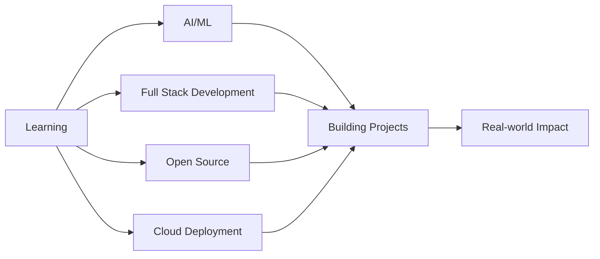
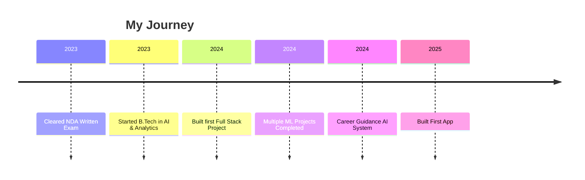

<div align="center">

# 👋 Hi, I'm Ronit Singh

### 🚀 Web Developer | AI Enthusiast | Problem Solver


[](https://www.linkedin.com/in/ronit-singh-004b69271/)
[](mailto:singhronit128@gmail.com)


</div>

---

## 🚀 About Me

I'm an **entrepreneurial enthusiast**, a dedicated **web developer**, and an **AI & Analytics student** passionate about building innovative, data-driven, and user-centric digital solutions.

```javascript
const ronit = {
    location: "India 🇮🇳",
    education: "B.Tech Honours (AI & Analytics)",
    cpi: 7.69,
    currentFocus: ["AI/ML", "Full Stack Development", "Cloud Deployment"],
    hobbies: ["Badminton 🏸", "Sketching 🎨", "E-Sports 🎮"],
};
```

- 🌐 **Web Developer** crafting impactful digital experiences
- 🤖 Exploring **AI, Machine Learning, and Analytics**
- 🧠 Passionate about **smart systems** that learn and improve over time
- 💡 Love solving **real-world problems** with tech and creativity
- 🎓 **B.Tech Honours (AI & Analytics)** —  CPI: 8

---

## 🛠️ Tech Stack & Skills

<div align="center">

### Frontend Development


### Backend Development


### Databases


### AI/ML & Data Science


### Tools & Platforms


### Authentication & Cloud


### Automation & Jobs


</div>

---

## 📌 Featured Projects

<div align="center">

<table>
<tr>
<td width="50%" valign="top">
<h3 align="center">🔹 Fusion IDE</h3>
<br />
<p align="center">


</p>
<p align="center">
A collaborative real-time code editor with compiler integration and live sharing capabilities.
</p>
<p align="center">
<strong>🔗 Real-time collaboration</strong><br />
<strong>⚡ Built-in compiler</strong><br />
<strong>📤 Live code sharing</strong>
</p>
</td>

<td width="50%" valign="top">
<h3 align="center">🔹 AI Voice Cloning System</h3>
<br />
<p align="center">


</p>
<p align="center">
Deep learning-based system for cloning human voice into synthetic speech using advanced TTS models.
</p>
<p align="center">
<strong>🎙️ Voice synthesis</strong><br />
<strong>🤖 Deep learning model</strong><br />
<strong>🔊 Audio processing</strong>
</p>
</td>
</tr>

<tr>
<td width="50%" valign="top">
<h3 align="center">🔹 Autonomous Vehicle GUI</h3>
<br />
<p align="center">


</p>
<p align="center">
A real-time ROS-based dashboard for monitoring and visualizing autonomous vehicle data.
</p>
<p align="center">
<strong>🚗 Vehicle data visualization</strong><br />
<strong>📡 Real-time monitoring</strong><br />
<strong>🎛️ Interactive dashboard</strong>
</p>
</td>

<td width="50%" valign="top">
<h3 align="center">🔹 Workflow Automation Builder</h3>
<br />
<p align="center">


</p>
<p align="center">
A system for building automated workflows that connect different services, APIs, and scheduled tasks.
</p>
<p align="center">
<strong>⚙️ Workflow automation</strong><br />
<strong>🔗 API integrations</strong><br />
<strong>⏱️ Scheduled task execution</strong>
</p>
</td>
</tr>
</table>

</div>


---

## 📊 GitHub Statistics

<div align="center">


</div>

---

## 🎯 Current Focus

<div align="center">



</div>

- 🔭 Currently working on **3D Visualisation Platform for Coding Problems with cloud deployment**
- 🌱 Learning **Advanced Machine Learning**, **Cloud Technologies**, and **Mobile Development**
- 👯 Looking to collaborate on **Open Source AI Projects** and **Web Apps**
- 💬 Ask me about **Web Development, AI/ML, Web Dev and Entrepreneurship**
---

## 🏸 Beyond Code

<div align="center">

| 🏆 Interest | 💡 Description |
|-------------|----------------|
| **🏸 Badminton** | Smashing serves and volleys |
| **🎨 Sketching** | Creating art when not coding |
| **🎮 E-Sports** | Competitive gaming enthusiast |
| **📚 Learning** | Science & tech content consumer |

</div>

---

## 💼 Experience Timeline

<div align="center">



</div>

---

## 🤝 Let's Connect!

<div align="center">

I'm always open to interesting conversations and collaboration opportunities!

[](https://www.linkedin.com/in/ronit-singh-004b69271/)
[](mailto:singhronit128@gmail.com)

### ✨ *"Building the future, one line of code at a time"* ✨

---


</div>
